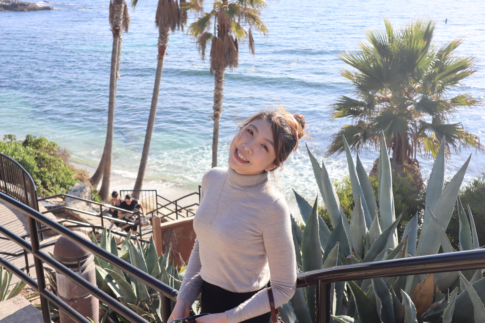

Hi, I am a fourth year Ph.D. students in the [Quantitative Methods and Computational Psychology](https://dornsife.usc.edu/psyc/quantitative-methods/) program at the University of Southern California (USC). I am from Shandong, China and my native language is mandarin. I pursued my bachelor degree at [Dickinson College](https://www.dickinson.edu/) with double major in Mathematics and Psychology. My interest in using statistical tools to understand human behaviors led me to pursue a Phd degree in quantitative psychology. 

My current research interests are measurement bias in survey/questionnaires and robust statistical models, such as hierarchical linear model(linear mixed effects model), latent variable model (structural equation modeling), etc. I am co-advised by Dr. Hok Chio(Mark) Lai (https://quantscience.rbind.io/) and Dr. Rand Wilcox. I am interested in exploring research questions related to fair and accurate psychological measurement using psychometric methods and statistical models. Check out the [Research]() page for specific projects and [Publication]() page for my publications. CV can be found [here](2022_cv.pdf)